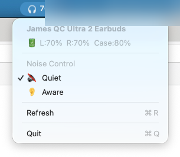

# ANChor ⚓

A lightweight macOS menu bar app for controlling Bose QuietComfort Ultra Earbuds noise cancellation modes.


## Features

- 🎧 **Menu bar integration** — always accessible, no dock icon
- 🔋 **Battery levels** — left, right, and case percentages shown in menu bar
- 🔇 **Noise control** — switch between Quiet and Aware modes with one click
- ⚡ **Instant switching** — direct RFCOMM/BMAP communication, no app relay needed

## Screenshot



The menu bar shows a headphone icon with battery percentage and current mode indicator. Clicking it reveals:

- Device name
- Battery levels (Left / Right / Case)
- Noise mode toggles (Quiet ✓ / Aware)
- Refresh and Quit options

## Supported Devices

| Device | Codename | Product ID | Status |
|--------|----------|-----------|--------|
| QC Ultra Earbuds (2nd Gen) | edith | 0x4062 | ✅ Tested |
| QC Ultra Earbuds (1st Gen) | scotty | 0x4072 | Should work* |

*These devices use the same BMAP protocol. Contributions with test results welcome!

## Requirements

- macOS 13+ (Ventura or later)
- Bose earbuds/headphones paired and connected via Bluetooth
- Xcode Command Line Tools (for building)

## Installation

### Build from source

```bash
git clone https://github.com/YOUR_USERNAME/ANChor.git
cd ANChor
swift build -c release
```

The binary will be at `.build/release/ANChor`.

### Create an app bundle (optional)

```bash
./scripts/bundle.sh
# Creates ANChor.app — drag to /Applications
```

### Run

```bash
# Direct binary
.build/release/ANChor

# Or if you created the app bundle
open ANChor.app
```

## Configuration

ANChor **automatically discovers** paired Bose devices — no manual setup required. It scans your paired Bluetooth devices for known Bose name patterns and connects to the first one found (preferring already-connected devices).

If multiple Bose devices are paired, it will connect to whichever is currently active.

## How It Works

ANChor communicates with Bose devices using the **BMAP (Bose Messaging and Protocol)** over Classic Bluetooth RFCOMM channel 2. This is the same protocol the Bose Music app uses.

### Protocol Overview

```
Packet: [fblock_id, function_id, operator, payload_length, ...payload]

Operators:
  0x01 = GET    (read a value)
  0x05 = START  (trigger action, e.g. mode switch)

Key addresses:
  [31.3] = Current noise mode (0=Quiet, 1=Aware)
  [2.2]  = Battery levels
  [1.5]  = CNC level (0-10 slider)
  [0.5]  = Firmware version
```

### Mode Switching

```
TX: [0x1F, 0x03, 0x05, 0x02, mode_idx, announce_flag]
RX: [0x1F, 0x03, 0x06, 0x01, new_mode_idx]  (RESULT = success)
```

## Known Limitations

- **macOS only** — uses IOBluetooth framework (no Linux/Windows support)
- **RFCOMM channel lockout** — if the app crashes or disconnects uncleanly, you may need to disconnect/reconnect your earbuds via System Settings before the app can reconnect
- **Single device** — currently supports one hardcoded device address
- **No CNC slider** — direct CNC level control requires cloud-mediated ECDH auth (Bose restriction)

## Troubleshooting

**"Connecting..." stays forever**
- Disconnect earbuds from Bluetooth (System Settings → Bluetooth → Disconnect)
- Reconnect earbuds
- Click "Reconnect" in the menu or restart the app

**No battery shown**
- Click "Refresh" — battery query may have timed out on initial connect

## Acknowledgments

- **[bosectl](https://github.com/aaronsb/bosectl)** by Aaron Bockelie — BMAP protocol documentation and reference implementation that made this project possible. The protocol knowledge (packet format, feature addresses, device catalog) was invaluable.
- **[Bose-QuietComfort-Ultra-Protocol](https://github.com/docentYT/Bose-QuietComfort-Ultra-Protocol)** by docentYT — additional protocol documentation.

## Contributing

Contributions welcome! Especially:
- Testing with other Bose devices (QC45, QC35, NC700, etc.)
- Auto-discovery of paired Bose devices
- Keyboard shortcuts / global hotkeys
- Launch at login support
- SwiftUI popover UI (instead of NSMenu)

## License

MIT — see [LICENSE](LICENSE).
